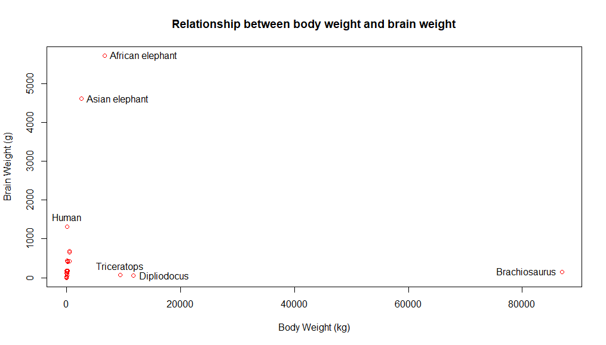
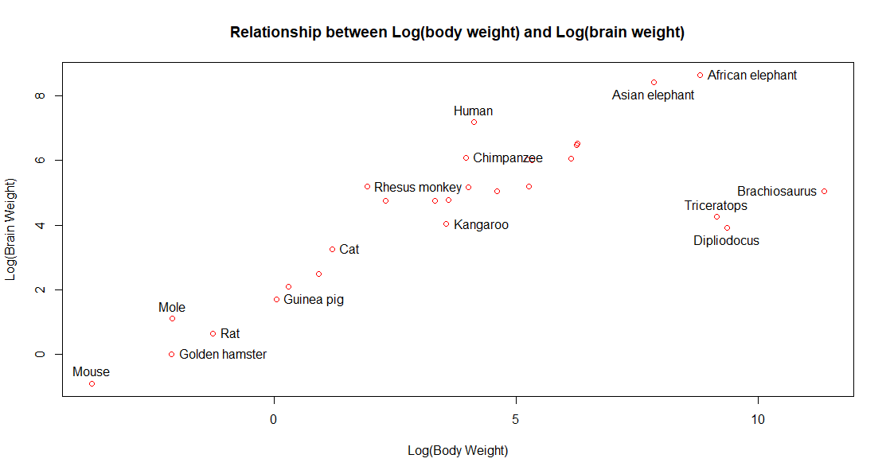
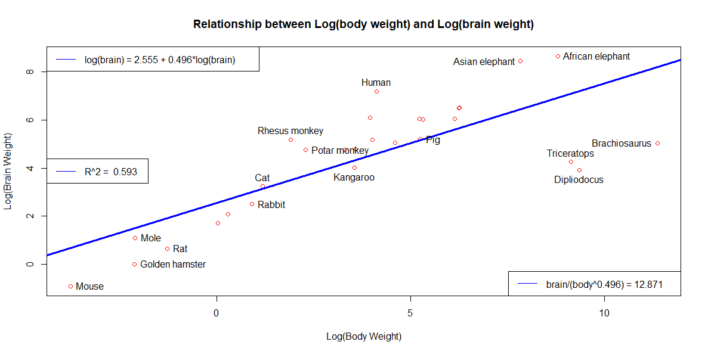

&nbsp;

```{r, get_dat, warning=FALSE, message=FALSE}
library(MASS)
dat <- Animals
```

1.	What is the dimension of the data.
```{r, fig.width=8, fig.height=8}
dim(dat)
# The data has 28 rows/observations and 2 columns/variables
```

&nbsp;

2.   Describe the data.
```{r, fig.width=8, fig.height=8}
# The animals dataset contains the average brain and body weights for 
# 28 species of land animals.  The body variable represents body weight in kg,
# and the brain variable represents the brain weight in g.
# We can also look at the summary of the data to see what's going on. And also
# we can look at the first 6 rows to get a good idea of the data.
summary(dat)
# It looks like our lightest animal weighsin only at 0.02 kg, while our biggest
# weighs 87,000 kg!  Likewise, the lightest brain weighs 0.4 g, whereas the 
# largest brain is 5712 g.
head(dat)
```

&nbsp;

3.  Scatter plot of the data with x-axis 'body' and y-axis 'brain.' Identify as many data points as you can. Comment on the plot. 
```{r, fig.width=8, fig.height=8}
#plot(dat$body, dat$brain, xlab = "Body Weight (kg)", ylab = "Brain Weight (g)", 
#     main = "Relationship between body weight and brain weight",
#     col = "red")

# ID points we want to label:
#identify(dat$body, dat$brain, labels = rownames(dat))

# Plots were generated using commands above and saved, then inserted into this document.

```

&nbsp;

4.  Show the scatter plot of the data after the logarithmic transformation. 
    Identify as many points as you can.
    Comment on the plot. 
    Obtain the simple linear regression model.
    Draw the line on the scatter plot.
    Make the graph as informative as possible.
```{r, fig.width=8, fig.height=8}
l_dat <- log(dat[,1:2])


#plot(l_dat$body, l_dat$brain, xlab = "Log(Body Weight)", ylab = "Log(Brain Weight)",      
#     main = "Relationship between Log(body weight) and Log(brain #weight)",
#     col = "red")

# ID points we want to label:
#identify(l_dat$body, l_dat$brain, labels = rownames(l_dat))

# Plots were generated using commands above and saved, then inserted into this document.

```

The Log of brain weight and log of body weight seem to have a much more linear
relationship than the non-log forms of each value.  However when we do the 
actual linear fit, we get a low R^2 value of 0.592, indicating the fit isn't 
very good, further indicating that the linear relationship isn't that close.
```{r, fig.width=8, fig.height=8}
mod <- lm(brain ~ body, l_dat)

#plot(l_dat$body, l_dat$brain, xlab = "Log(Body Weight)", ylab = "Log(Brain Weight)",      
#     main = "Relationship between Log(body weight) and Log(brain weight)",col = "red")

#identify(l_dat$body, l_dat$brain, labels = rownames(l_dat))


# Now lets add the linear regression to the plot.
#abline(mod, col = "blue", lwd = 3, lty = 1)
#legend("topleft", legend = "log(brain) = 2.555 + 0.496*log(brain) ", lty = 1, col = "blue")
#legend("bottomright", legend = "brain/(body^0.496) = 12.871", lty = 1, col = "blue")
#legend("left", legend = paste("R^2 = ", round(summary(mod)$adj.r.squared,3)), lty = 1, col = "blue")

# Plots were generated using commands above and saved, then inserted into this document.
```


&nbsp;

5.  Remove the dinosaurs.
    Show the scatter plot of the resultant data after the logarithmic transformation. 
    Identify as many points as you can.
    Comment on the plot. 
    Obtain the simple linear regression model.
    Draw the line on the scatter plot.
    Make the graph as informative as possible.
```{r, fig.width=8, fig.height=8}

```

&nbsp;

6.  Write the prediction model coming from Question 5 directly in terms of the original variables.


7. Calculate the ratio of the model from Question 6 for all animals in the data. 
   Arrange the ratios in increasing order of magnitude. 
   Comment on the output. 

```{r, fig.width=8, fig.height=8}

```

8. Comment on the graphs in Questions 5 and 6. 

&nbsp;
