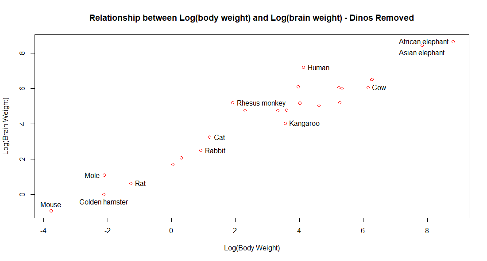
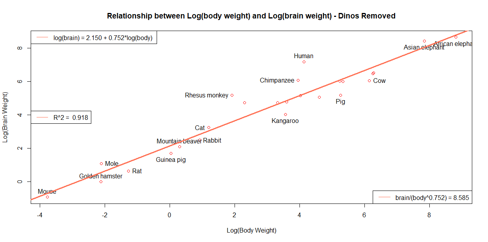

&nbsp;

```{r, get_dat, warning=FALSE, message=FALSE}
setwd("C:/Users/lapt3u/Box/UC/Fall_2018/BE7023_Adv_Biostats/adv_biostats/hw_2")
library(MASS)
dat <- Animals
```

&nbsp;

1.	What is the dimension of the data.
```{r, fig.width=8, fig.height=8}
dim(dat)
# The data has 28 rows/observations and 2 columns/variables
```

&nbsp;

2.   Describe the data.
```{r, fig.width=8, fig.height=8}
# The animals dataset contains the average brain and body weights for 
# 28 species of land animals.  The body variable represents body weight in kg,
# and the brain variable represents the brain weight in g.
# We can also look at the summary of the data to see what's going on. And also
# we can look at the first 6 rows to get a good idea of the data.
summary(dat)
# It looks like our lightest animal weighs in at only 0.02 kg, while our biggest
# weighs 87,000 kg!  Likewise, the lightest brain weighs 0.4 g, whereas the 
# largest brain is 5712 g.
head(dat)
```

&nbsp;

3.  Scatter plot of the data with x-axis 'body' and y-axis 'brain.' Identify as many data points as you can. Comment on the plot. 
```{r, fig.width=8, fig.height=8}
#plot(dat$body, dat$brain, xlab = "Body Weight (kg)", ylab = "Brain Weight (g)", 
#     main = "Relationship between body weight and brain weight",
#     col = "red")

# ID points we want to label:
#identify(dat$body, dat$brain, labels = rownames(dat))

# Plots were generated using commands above and saved, then inserted into this document.

```

This plot is definitely interesting.  It looks like these 3 dinosaurs, Triceratops,
Diplodocus, and Brachiosaurus, have very different brain to body ratios than the rest of the animals.  We should do a  log transform to see if that gives us a linear relationship, but even then
it's possible we might need to remove the dinosaurs from the data to get a 
good linear relationship between the brain weight and the body weight.

&nbsp;
&nbsp;

4.  Show the scatter plot of the data after the logarithmic transformation. 
    Identify as many points as you can.
    Comment on the plot. 
    Obtain the simple linear regression model.
    Draw the line on the scatter plot.
    Make the graph as informative as possible.
```{r, fig.width=8, fig.height=8}
l_dat <- log(dat[,1:2])


#plot(l_dat$body, l_dat$brain, xlab = "Log(Body Weight)", ylab = "Log(Brain Weight)",      
#     main = "Relationship between Log(body weight) and Log(brain #weight)",
#     col = "red")

# ID points we want to label:
#identify(l_dat$body, l_dat$brain, labels = rownames(l_dat))

# Plots were generated using commands above and saved, then inserted into this document.

```

Do the linear regression and plot again...

```{r, fig.width=8, fig.height=8}
mod <- lm(brain ~ body, l_dat)

#plot(l_dat$body, l_dat$brain, xlab = "Log(Body Weight)", ylab = "Log(Brain Weight)",      
#     main = "Relationship between Log(body weight) and Log(brain weight)",col = "red")

#identify(l_dat$body, l_dat$brain, labels = rownames(l_dat))


# Now lets add the linear regression to the plot.
#abline(mod, col = "blue", lwd = 3, lty = 1)
#legend("topleft", legend = "log(brain) = 2.555 + 0.496*log(brain) ", lty = 1, col = "blue")
#legend("bottomright", legend = "brain/(body^0.496) = 12.871", lty = 1, col = "blue")
#legend("left", legend = paste("R^2 = ", round(summary(mod)$adj.r.squared,3)), lty = 1, col = "blue")

# Plots were generated using commands above and saved, then inserted into this document.
```

The Log of brain weight and log of body weight seem to have a much more linear
relationship than the non-log forms of each value.  However when we do the 
actual linear fit, we get a low R^2 value of 0.592, indicating the fit isn't 
very good, further we can see the dinosaurs are still very far from the rest
of the animals so it might be good to think about removing those from the data
and trying the linear fit again.

&nbsp;

5.  Remove the dinosaurs.
    Show the scatter plot of the resultant data after the logarithmic transformation. 
    Identify as many points as you can.
    Comment on the plot. 
    Obtain the simple linear regression model.
    Draw the line on the scatter plot.
    Make the graph as informative as possible.
```{r, fig.width=8, fig.height=8}
dinos <- c("Dipliodocus", "Brachiosaurus", "Triceratops")
dat_dino <- dat[!rownames(dat) %in% dinos,]
l_dat_dino <- l_dat[!rownames(l_dat) %in% dinos,]

#plot(l_dat_dino$body, l_dat_dino$brain, xlab = "Log(Body Weight)", ylab = "Log(Brain Weight)",      
#     main = "Relationship between Log(body weight) and Log(brain weight) - Dinos Removed",
#     col = "red")

# ID points we want to label:
#identify(l_dat_dino$body, l_dat_dino$brain, labels = rownames(l_dat_dino))
# Plots were generated using commands above and saved, then inserted into this document.

```


The relationship between the log of the body weight and the log of the brain
weight after removing the dinosaurs looks much more linear, which makes sense 
as the dinosaurs definitely appeared to be outliers.

Do the linear regression and plot again...

```{r, fig.width=8, fig.height=8}

mod_dino <- lm(brain ~ body, l_dat_dino)
# Now lets add the linear regression to the plot.
#plot(l_dat_dino$body, l_dat_dino$brain, xlab = "Log(Body Weight)", ylab = "Log(Brain Weight)",      
#     main = "Relationship between Log(body weight) and Log(brain weight) - Dinos Removed",
#     col = "red")

# ID points we want to label:
#identify(l_dat_dino$body, l_dat_dino$brain, labels = rownames(l_dat_dino))

#abline(mod_dino, col = "coral1", lwd = 3, lty = 1)
#legend("topleft", legend = "log(brain) = 2.150 + 0.752*log(body) ", lty = 1, col = "coral1")
#legend("bottomright", legend = "brain/(body^0.752) = 8.585", lty = 1, col = "coral1")
#legend("left", legend = paste("R^2 = ", round(summary(mod_dino)$adj.r.squared,3)), lty = 1, col = "coral1")

# Plots were generated using commands above and saved, then inserted into this document.
```


&nbsp;

6.  Write the prediction model coming from Question 5 directly in terms of the original variables.  
log(brain) = 2.150 + 0.752*log(body)  
log(brain) = log(8.585) + 0.752*log(body)  
log(brain) = log(8.585) + 0.752*log(body)  
log(brain) = log(8.585 * body^0.752)  
**brain/(body^0.752) = 8.585**  

&nbsp;


7. Calculate the ratio of the model from Question 6 for all animals in the data. 
   Arrange the ratios in increasing order of magnitude. 
   Comment on the output. 

```{r, fig.width=8, fig.height=8}
# Starting with the original animals data that still includes dinosaurs.
dat$ratio <- dat$brain/(dat$body^0.752) 
dat <- dat[order(dat$ratio),]
dat
library(car)
outlierTest(mod)
# This data shows that humans have the greatest brain to body ratio of the 28
# animals included in this study.  Our evolutionary neighbors, monkeys and chimps
# also have higher than the average brain to body ratios as well.  
#Using the outlierTest function we can see that none of the brain to body 
#ratios are outliers using the Bonferonni adjusted p-value.
```

8. Comment on the graphs in Questions 5 and 6.(Assuming 4 and 5 were meant)  
&nbsp;

While both plots to the eye look decently linear, although when the dinosaurs
are removed it does look more linear, the true test of the linear relationship
between the log of the brain weight and the log of the body weight is to complete
a linear fit and examine the R2 value to see how well the fit, fits on the data.
The original data has an R2 of 0.593 while the data when leaving out the dinosaurs 
has an R2 of 0.918, indicating that the relationship is much more linear having
removed the dinosaurs from the data.  However using the outlierTest method in the
car package none of the dinosaurs or any other animals for that fact are outliers
when using the Bonferonni adjusted p-value.

&nbsp;
